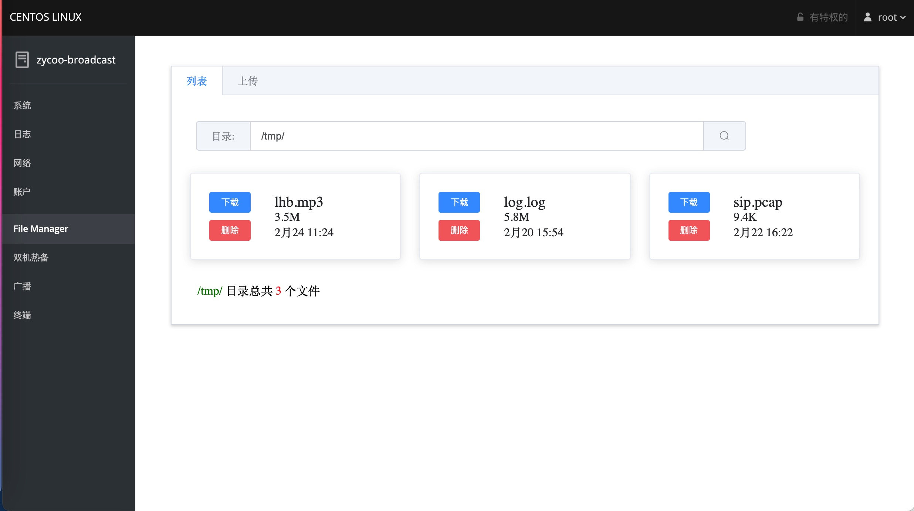

# [FileManager](https://github.com/tqcenglish/filemanager)

通过 Cockpit 对 tmp 文件进行简单管理(上传/下载), 这是一个 cockpit 插件 Demo.

# 0.1
使用 cockpit.css 样式

# 0.2 
引入 vue.js, element-ui. 在样式上完全独立，使用双向绑定更容易实现业务功能(例如循环显示等)

## 安装

git clone https://github.com/tqcenglish/filemanager /usr/share/cockpit/filemanager

